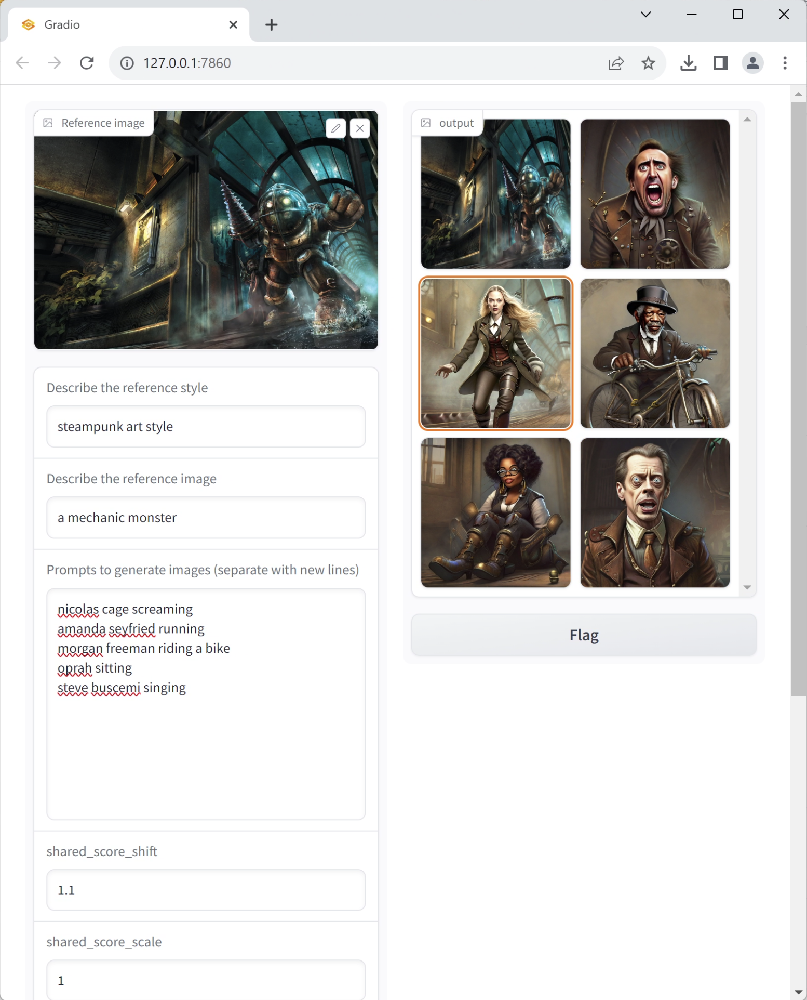
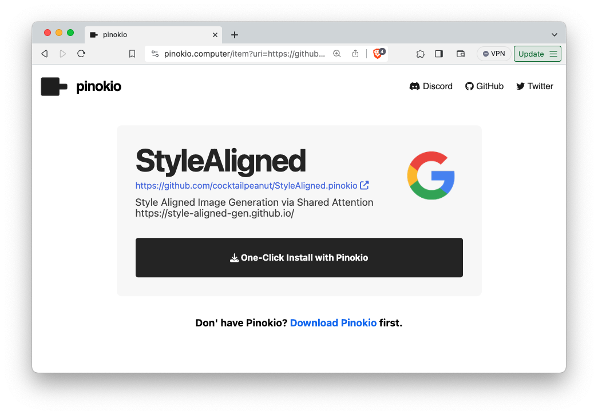

# StyleAligned Web UI

This repository is a [gradio](https://www.gradio.app/) web UI for running **Image to Image** using [StyleAligned](https://github.com/google/style-aligned).



# What is this project?

This took the core code from the StyleAligned repo, and added the following:

1. Gradio WebUI.
2. Supports all OS: including Mac (MPS) support
3. Adds the ability use in low memory settings (512x512 as well as 1024x1024)
4. Built-in 1 Click Installer for running locally.

# Usage

You can install manually, or use the 1 Click installer.

## A. 1 Click Installer

You can use Pinokio to install this repository on all platforms (Mac, Windows, Linux): 

**1 Click Installer:** https://pinokio.computer/item?uri=https://github.com/cocktailpeanut/StyleAligned.pinokio




## B. Manual Install

First, clone the repo

```
git clone https://github.com/cocktailpeanut/StyleAligned.pinokio
```

Next, create a venv and install dependencies:

```
python -m venv venv

# Mac
pip3 install torch torchvision torchaudio

# Windows CUDA
pip3 install torch torchvision torchaudio --index-url https://download.pytorch.org/whl/cu118


# Linux CUDA
pip3 install torch torchvision torchaudio --index-url https://download.pytorch.org/whl/cu118

# Linux ROCm
pip3 install torch torchvision torchaudio --index-url https://download.pytorch.org/whl/rocm5.6

# Install the App dependencies
pip install -r requirements.txt
```

Now launch the app:

```
python app.py
```
